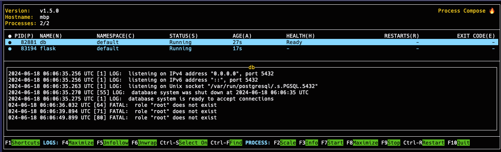

# devbox_demo



Devbox demo for the [OKC WebDevs Tool Talks](https://www.meetup.com/okcwebdevs/events/301038372/) hosted by [Clevyr](https://clevyr.com/).

## Minimum Requirements
* macOS, Linux, or [WSL](https://docs.microsoft.com/en-us/windows/wsl/install)
* [devbox](https://www.jetify.com/devbox/docs/installing_devbox/)

## Recommended Requirements
* [Docker](https://docs.docker.com/get-docker/)
  * While devbox _can_ run [PostgreSQL](https://www.jetify.com/devbox/docs/devbox_examples/databases/postgres/) as a plugin, it's more efficient to run it in a container while developing the frontend/backend of an application.

## Quickstart
1. Clone this repository: 
   ```bash
   git clone https://github.com/pythoninthegrass/devbox_demo.git && cd devbox_demo
   ```
2. Run `devbox shell`
3. Start services[^1]
   * `devbox services up` (terminal user interface)
   * `devbox services start` (daemon)
4. Navigate to [localhost:5000](http://localhost:5000) in your browser
5. Stop services with either `devbox services stop` or `F10` in the TUI
6. Deactivate the shell with `exit`

## Development
```bash
# run tests
devbox run test

# add packages
devbox search <package>
devbox add <package>            # add latest package
devbox add <package>@<version>  # add specific version

# remove packages
devbox remove <package>

# use poetry to get all dependencies
devbox shell
poetry shell
poetry install

# update requirements
poetry add <package>

# export requirements.txt (uv/pip compatibility)
devbox run export
```

## TODO
* ~~Fix Tailwind CSS styling~~
* ~~Add a database~~
* Add taskfile
* Add CI/CD using `devbox`

## Further Reading
* [devbox docs](https://www.jetify.com/devbox/docs/)
* [process-compose](https://f1bonacc1.github.io/process-compose/launcher/)
* [Orchestrate your Dev Environment using Devbox](https://meijer.ws/articles/orchestrate-your-dev-environment-using-devbox)
* [postgres docker image](https://hub.docker.com/_/postgres)
* [flask](https://flask.palletsprojects.com/en/3.0.x/server/)
* [tailwindcss](https://tailwindcss.com/docs/installation/play-cdn)

[^1]: `devbox shell` does [not natively](https://github.com/jetify-com/devbox/issues/1611#issuecomment-1802305800) read the `.env` file the same way as `docker compose`. Use `devbox shell --env-file .env` to pass the `.env` file to the shell.
